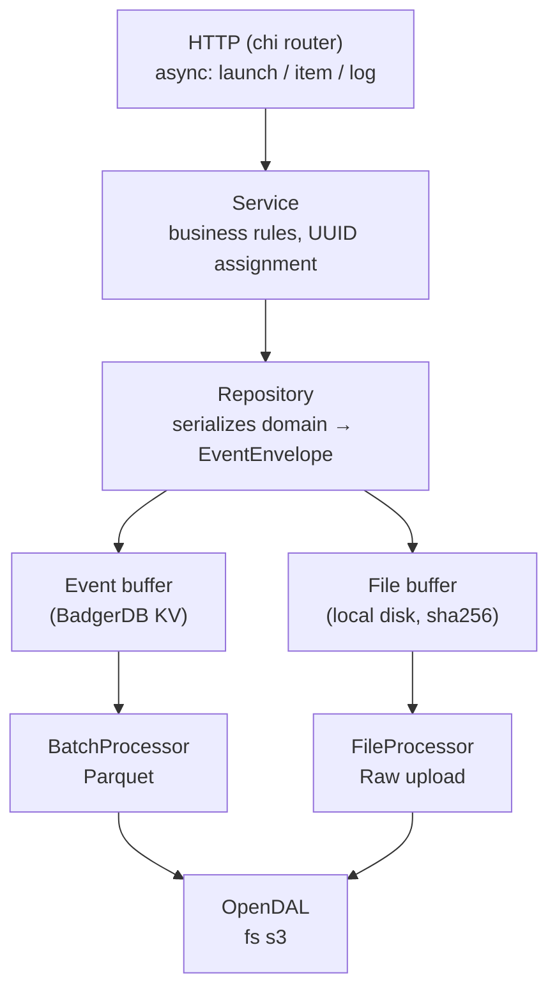

# Ingest service

> This is a proof of concept for validating the hypothesis of writing agent data to Parquet files for subsequent analytics. The primary goal is to build a lightweight, self-contained service that can be run independently in any environment.

Ingest service for ReportPortal agents data

- [Ingest service](#ingest-service)
  - [Overview](#overview)
  - [Tech stack](#tech-stack)
  - [Architecture](#architecture)
    - [Layers](#layers)
    - [Event path (logs, items, launches)](#event-path-logs-items-launches)
    - [File path (log attachments)](#file-path-log-attachments)
    - [Storage backend](#storage-backend)
    - [Lifecycle](#lifecycle)
  - [Configuration](#configuration)
    - [Server](#server)
    - [Logging](#logging)
    - [Buffers](#buffers)
    - [Storage](#storage)
    - [S3 (used when `STORAGE_TYPE=s3`)](#s3-used-when-storage_types3)
    - [Processors](#processors)
  - [Non-goals](#non-goals)
  - [Roadmap](#roadmap)


## Overview

The current ReportPortal API persists agent data into PostgreSQL and depends on a heavy infrastructure footprint: 
a relational database, RabbitMQ as a message broker, and other components such as the Job service
for background processing. 

This makes the platform expensive to run, hard to scale horizontally, and complicated to deploy in lightweight or
short-lived environments.

This project is an attempt to rethink that approach. 
Instead of treating incoming agent data as mutable rows in a relational schema,
the ingest service treats it as an append-only stream of events:

1. Agents send data to the service over HTTP.
2. The service acknowledges the request quickly and writes the payload into a local buffer (BadgerDB) for durability and back-pressure handling.
3. A background processor flushes batches into Parquet files on the configured storage backend (local filesystem or S3-compatible object storage via OpenDAL).
4. Once written, Parquet files are immutable — data is never updated in place, only appended.

The service intentionally does **not** provide query, aggregation, or visualization capabilities over the stored data.

Parquet was chosen precisely because it is an open, columnar format that any modern analytical engine can read directly.
To analyze the captured events, point a separate tool at the Parquet location — for example
DuckDB for ad-hoc local queries, Spark or Trino for distributed workloads, or any data warehouse that supports external
Parquet tables.

The result is a small, self-contained Go binary that can be deployed on its own, scaled by simply running more
instances, and integrated into any analytics stack the user already operates.

## Tech stack

- Chi - Go HTTP router.
- BadgerDB - Fast key-value database for buffering data.
- Parquet-go - Library for reading and writing Parquet files in Go.
- OpenDAL - Library for simple integration with filesystem and AWS S3 API.

## Architecture

The service follows the classic three-layer Go layout — `handler → service → data` — with two
asynchronous background processors that move buffered data toward its final destination.



### Layers

- **handler/** — Chi-based HTTP layer. Parses requests, validates payloads, returns RP-compatible
  responses. Routes are mounted under `/api/v1/{projectName}` and `/api/v2/{projectName}` for
  launches, items and logs.
- **service/** — orchestrates business logic: assigns UUIDs, links log attachments to the staged
  files, returns domain errors.
- **data/repository/** — converts domain models into `EventEnvelope`s (an append-only event with
  `EntityType`, `Operation`, `Timestamp`, raw JSON payload) and pushes them into the buffer.
- **data/buffer/** — durable buffers in front of the slow path (Parquet/object storage). Two
  separate buffers exist: one for events, one for binary attachments.
- **data/parquet/** — Parquet writers per entity type (launch / item / log) with their own schemas
  in `parquet/scheme/`.
- **data/catalog/** — builds Hive-style partition paths so any external query engine can prune by
  project, launch, entity and date without reading the data.
- **processor/** — background workers that drain the buffers on a tick.

### Event path (logs, items, launches)

1. The handler decodes the request and calls the service layer.
2. The repository wraps the domain object into an `EventEnvelope` and calls `Buffer.Put`.
3. `BadgerBuffer` (default implementation of `Buffer`) writes the envelope under a key shaped like
   `event:<entity>:<unix_nano>:<id>`. This gives durable, ordered, append-only storage with no
   external dependencies.
4. `BatchProcessor` wakes up on `flush_interval`, reads up to `read_limit` envelopes, groups them
   by `(project, launch, entity_type, event_date)` and writes each group as a Parquet file.
5. After a successful write, `Buffer.Ack` deletes the consumed keys from BadgerDB. Until ack the
   data stays in the buffer, so a crash mid-flush is recovered by reprocessing on restart.

Parquet files are placed under a Hive-style partitioned path:

```
project=<name>/launch_uuid=<uuid>/events/entity=<launch|item|log>/event_date=<YYYY-MM-DD>/batch_id=<ts>/
```

This layout lets DuckDB, Spark, Trino, etc. read the dataset directly with predicate pushdown on
project / launch / entity / date.

### File path (log attachments)

Log endpoints accept `multipart/form-data` with binary attachments. Files are not embedded into
Parquet — they are streamed to a separate pipeline:

1. **`FileBuffer`** — a content-addressed staging area on local disk. The handler streams each
   uploaded file through a `sha256` hasher into `<buffer_dir>/tmp/upload-*`, then atomically
   renames it to `<buffer_dir>/<catalog_path>/<sha256>`. Deduplication is implicit: identical
   payloads collapse to the same hash.
2. The hash is stored on the corresponding `Log` event so the Parquet record references the
   attachment by content hash.
3. **`FileProcessor`** — a separate background worker. On every `flush_interval` it lists files in
   the buffer (skipping the `tmp/` scratch directory), opens an OpenDAL `Writer` for the same
   relative path, streams the bytes to the storage backend, and only then deletes the local copy.
   Empty parent directories are pruned after deletion to keep the staging area clean.

Splitting events and files into two buffers keeps Parquet flushes cheap and predictable — large
binary blobs never block the event pipeline, and a slow object-storage upload never delays the
acknowledgement of a log write.

### Storage backend

All persistent writes go through a single `opendal.Operator`. Switching between local filesystem
and S3-compatible storage is a configuration change only — neither processor has any backend-
specific code.

### Lifecycle

`internal/app` wires everything together: HTTP server, BadgerDB, OpenDAL operator, and both
processors. On `SIGINT` / `SIGTERM` it cancels the shared context, waits for the HTTP server and
both processors to drain (`Done()` channels), closes the OpenDAL operator and finally closes the
buffer.

## Configuration

All configuration is loaded from environment variables (a `.env` file at the project root is
picked up automatically — see `.env.example`). Defaults are listed in parentheses.

### Server

- `HOST` (`0.0.0.0`) — bind address.
- `PORT` (`8080`) — TCP port.
- `ADDRESS` (`$HOST:$PORT`) — full bind address.
- `BASE_PATH` (`/api`) — prefix for all API routes.

### Logging

- `LOG_LEVEL` (`info`) — application log level.
- `LOG_HTTP_LEVEL` (`warn`) — HTTP request-log level.
- `LOG_FORMAT` (`json`) — `json` or `text`.
- `LOG_ADD_RESPONSE_BODY` (`false`) — include response bodies in HTTP logs.
- `LOG_ADD_SOURCE` (`false`) — include `file:line` in log records.

### Buffers

- `BUFFER_PATH` *(empty)* — BadgerDB directory for the event buffer; empty value enables
  in-memory mode.
- `BUFFER_CACHE_SIZE` (`256MiB`) — BadgerDB block cache size (`humanize` units).
- `BUFFER_INDEX_SIZE` *(empty)* — optional BadgerDB index cache size.
- `FILE_BUFFER_PATH` (`/data/staging`) — local staging directory for log attachments. When
  `STORAGE_TYPE=fs` and `FILE_BUFFER_PATH` resolves to the same path as `CATALOG_PATH`, the
  `FileProcessor` is disabled — files written by the handler are already in their final
  location, so no separate upload step is needed.

### Storage

- `STORAGE_TYPE` (`fs`) — OpenDAL backend: `fs` for local filesystem, `s3` for object storage.
- `CATALOG_PATH` (`/data/catalog`) — root path inside the storage backend for Parquet output.
- `PARQUET_COMPRESSION` (`snappy`) — Parquet compression codec.
- `PARQUET_ROW_GROUP_SIZE` (`1000`) — rows per Parquet row group.

### S3 (used when `STORAGE_TYPE=s3`)

- `S3_BUCKET` — bucket name.
- `S3_REGION` — AWS region.
- `S3_ENDPOINT` — custom endpoint (MinIO, R2, etc.).
- `S3_ACCESS_KEY` — access key ID.
- `S3_SECRET_KEY` — secret access key.
- `S3_SESSION_TOKEN` — optional STS session token.

### Processors

- `FLUSH_INTERVAL` (`30s`) — how often `BatchProcessor` drains the event buffer into Parquet.
- `FILES_FLUSH_INTERVAL` (`10s`) — how often `FileProcessor` uploads staged attachments.
- `READ_LIMIT` (`1000`) — max events read from the buffer per flush.

## Non-goals

The service is deliberately scoped down. The following are **not** in scope and will not be added:

- **Dataset-wide querying or analytics.** No SQL endpoint, no search API, no cross-launch
  aggregations. Point DuckDB / Spark / Trino / a warehouse at the Parquet location instead. A
  narrow per-launch summary endpoint may be offered later for quick verdicts (see the Roadmap),
  but general-purpose querying is intentionally left to external engines.
- **A web UI / dashboards.** Visualization belongs to a separate tool.
- **In-place updates or deletes.** Data is append-only by design; corrections are expressed as new
  events, not mutations of existing ones.
- **Replacing the existing ReportPortal API.** This is a focused ingest path for evaluating the
  Parquet-based approach, not a drop-in rewrite of every RP feature.
- **A required message broker.** BadgerDB plays the role of a local durable buffer in the default
  configuration, so no RabbitMQ/Kafka deployment is needed to run the service. A pluggable shared
  broker (e.g. Kafka) may be offered later as an opt-in for high-load deployments that want a
  single buffer across multiple ingest instances — see the Roadmap.
- **Coupled compute.** The service does not embed an analytics engine — keeping ingest and
  analysis decoupled is a deliberate design choice.

## Roadmap

- [ ] **Write notifications.** Emit events when batches are flushed to Parquet (webhook / pub-sub),
  so downstream consumers can trigger ETL or invalidate caches without polling the storage.
- [ ] **Per-launch summary report.** Generate a simple report aggregated from a single launch
  (counts, durations, pass/fail breakdown) so users get a quick verdict without spinning up an
  external query engine.
- [ ] **Pluggable shared queue.** Allow swapping the local BadgerDB buffer for a shared broker
  (Kafka or similar) under high load, so multiple ingest instances can share one durable queue
  instead of each managing its own local buffer.
